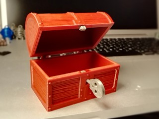
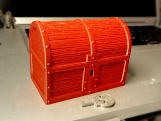
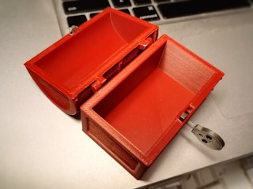
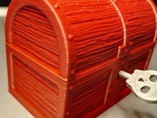
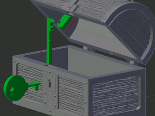
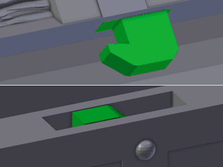
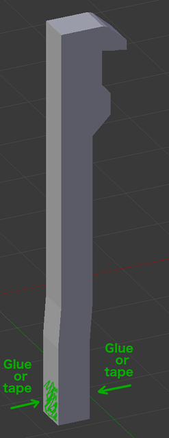

# Hinged Chest with Working Lock and Wood Texture
*3D printable toy treasure chest with a simple functional lock (formerly thing:2803507)*

### License
[Creative Commons - Attribution - Share Alike](https://creativecommons.org/licenses/by-sa/3.0/)

### Attribution
This is a remix of athey's Small Hinged Treasure Chest ([Thingiverse thing:27635](https://www.thingiverse.com/thing:27635)), using the wood texture from devonjones' OpenForge Wooden Floors ([Thingiverse thing:1585586](https://www.thingiverse.com/thing:1585586))

### Gallery

[🔎](images/chest1.jpg) [🔎](images/chest2.jpg) [🔎](images/chest3.jpg) [🔎](images/chest4.jpg) [🔎](images/Assembly.jpg) [🔎](images/Assembled.jpg)

## Description and Instructions

My godson has some kind of obsession with collecting small things in small chests, and he wanted a chest with a working lock. So, for his next birthday I took athey's [Small Hinged Treasure Chest](https://www.thingiverse.com/thing:27635) and designed a lock mechanism for it. Of course it is the most basic lock possible with only one possible key and picking it is trivial, but it is functional.
I also spiffed up the overall looks of the chest with extra details like the excellent wood texture from the [OpenForge Wooden Floors](https://www.thingiverse.com/thing:1585586) by devonjones.
The hinge has been made slightly beefier to reduce the risk of it breaking.

To unlock the chest, rotate the key counter-clockwise and open the lid while keeping the key turned. The lock cannot be left in the open position, closing the chest automatically locks it. [This video](https://youtu.be/TNOXzw1voPk) demonstrates how the chest works.

I made three different key designs, although the skull key will probably be the most popular with little (and big) children by far :)

Assembly is rather straightforward but the parts must be printed and mounted accurately for the lock to neither fail to close, nor be sloppy. See the images for instructions. On a well-calibrated printer the parts should only require minimal post-processing to make them fit. If your prints tend to be sloppy, some extra sanding and scraping may be required. See the post-printing section for more details.

The dimensions are 76 × 46 × 57 mm for the bulk of the chest, and 76 × 51 × 58 mm with the hinges and details included. It should be possible to scale up the model slightly, but you may need to scale up the latches a tiny bit more in two of the three dimensions to keep them a tight fit.

If you want to print the chest at 200% size, print the models from the *Scaled200Pct* subfolder with **Size200** prefix. These are already upscaled to 200% (meaning about 152 × 102 × 116 mm), and have been modified with reduced wall thickness and appropriate tolerances for the size. I haven't printed this larger model so I cannot guarantee it will work perfectly. Feedback is welcome!

## Printing

I printed the chest and lid with 0.2 mm layers in rigid.ink ‘Pearl Red’ ABS, with 20% infill. I used a brim to avoid warping.

The latches and keys were printed with 0.1 mm layers and 3 perimeters. It is important to print these parts with thin layers, to ensure they have an accurate thickness. You should also print them **slowly** to ensure the latches have an accurate shape.

Supports should not be needed for the regular size model. Even though the dome of the lid has overhangs that go beyond 45°, those overhangs are actually printed as bridges, therefore if your printer passes the [bridge torture test](https://www.thingiverse.com/thing:12925), you do not need supports. For the 200% model, supports might be required although it should still be possible to print without them.

If you print the lock parts with a rather flexible filament like PETG, the lower latch may be too flexible and you may need to print it in PLA or ABS instead for it to be stiff enough.

If you print the 200% size model, you may need to experiment with various infill settings for the ‘Size200-Latch_lower’ part to end up with something that is flexible enough.

## Post-printing

Make sure to remove any traces of a ‘squashed’ first layer (elephant's foot syndrome) on the latches and hole in the lid, through sanding or scraping with a knife. Try hooking the latches into each other with your hands: they shouldn't easily slip out of each other. If they get unhooked easily, try to adjust the hook shape with a knife.

If the latches are too thick to fit in the slots, sandpaper is your friend. Or you could print them again at a slightly smaller scale.

The lower latch (long piece) must be mounted in the chest with the hook pointing to the right, and the top perfectly flush with the edge (simply pushing it in on a flat table should do the trick). If you cannot push it deep enough, scrape off some material from the bottom end.
The latch in the lid must have its hook pointing to the left, and ideally the edges of the square part should be flush with the bottom edge of the lid. If the lock doesn't catch, you either need to pull this latch out again by a fraction of a millimeter, or shave off a bit of material with an X-acto knife.

If the lid doesn't close easily due to the latch bumping against the top edge of the chest, try sanding or scraping a bit of material from the front edge of the latch.

When printed accurately, the parts of the regular size model should fit tightly enough that no glue is required. The advantage of not using glue is that the latches will pop out of their sockets if the chest is pulled open with excessive force, instead of breaking and leaving bits behind that are impossible to repair. In other words, you need to make a choice between a chest that is harder to open without a key but will be broken if someone does manage to open it; or a chest that is easier to open but can be repaired if needed. After all this is just a toy, not a secure storage device!

If you do want to use glue, **do not use cyanoacrylate (super glue)** unless you are skilled in using it. It tends to solidify in a fraction of a second, causing the parts to become stuck before they can be inserted deep enough, making the lock unusable. The best place to apply glue with minimal risk of the latch becoming stuck, is shown in the following image. You could also try to use strips of adhesive tape to get a tighter but non-permanent fit.

## Updates

### 2018/07/25
Improved tolerances on the latch parts of the 200% size model.

## Tags
`box`, `chest`, `container`, `hinge`, `key`, `Lock`, `pirate`, `secret`, `toy`, `treasure`, `treasure_chest`
